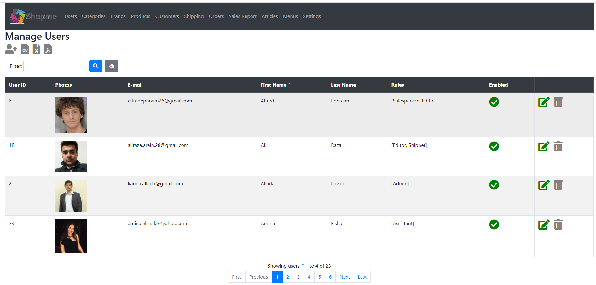
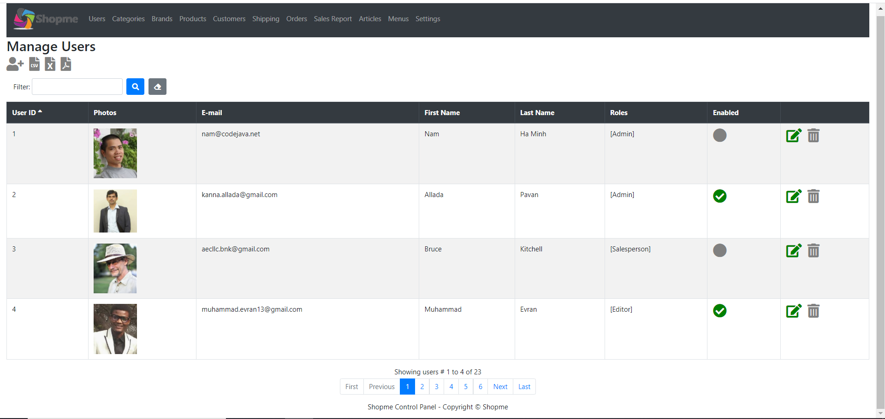
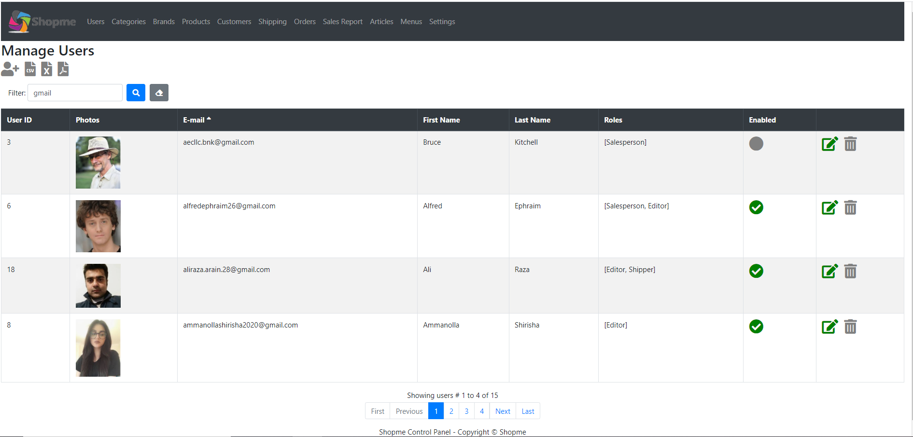
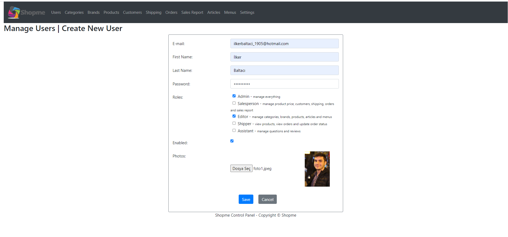
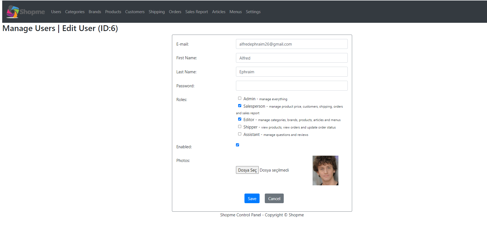
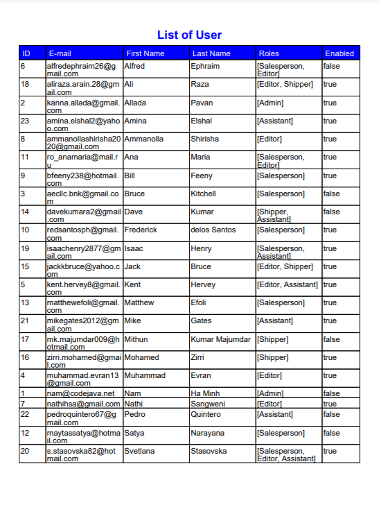
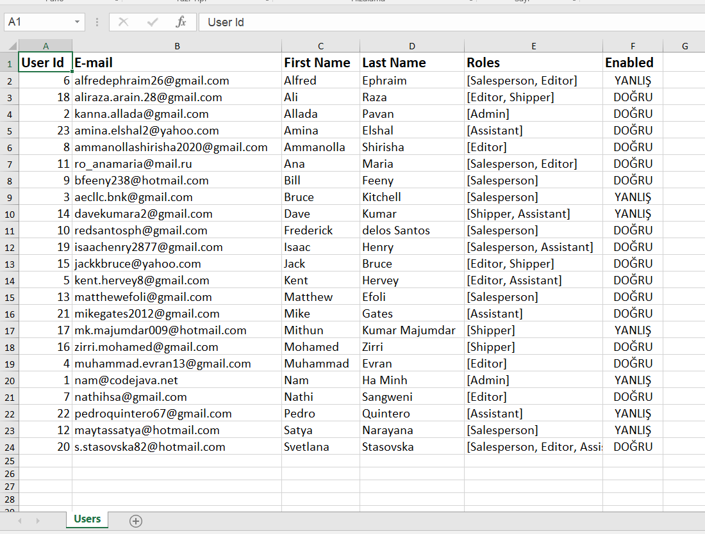
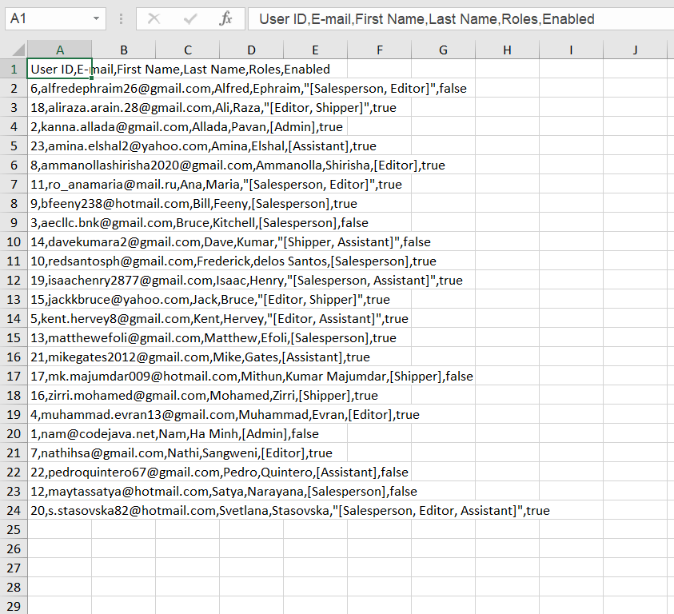

# shopme-eCommerce
e-Commerce Website Application using Java Spring Boot, Thymeleaf, jQuery, Bootstrap, MySQL

## User Module Website ScreenShots

- Main page
</img>
 
- Main page sorting by UserId
</img>
 
- Main Page filter by gmail and sorted by e-mail
</img>
 
- Create New User Tab
</img>
 
- Edit User Tab
</img>
 
- Exported PDF File
</img>
 
- Exported Excel File
</img>
 
- Exported CSV File
</img>